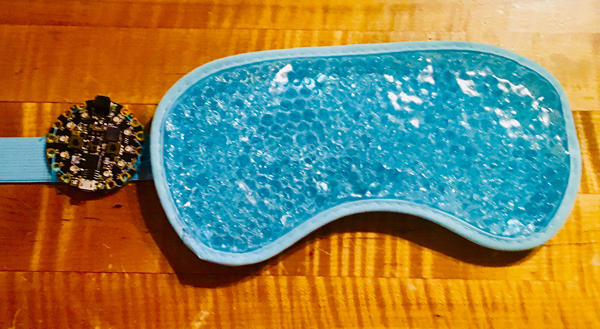
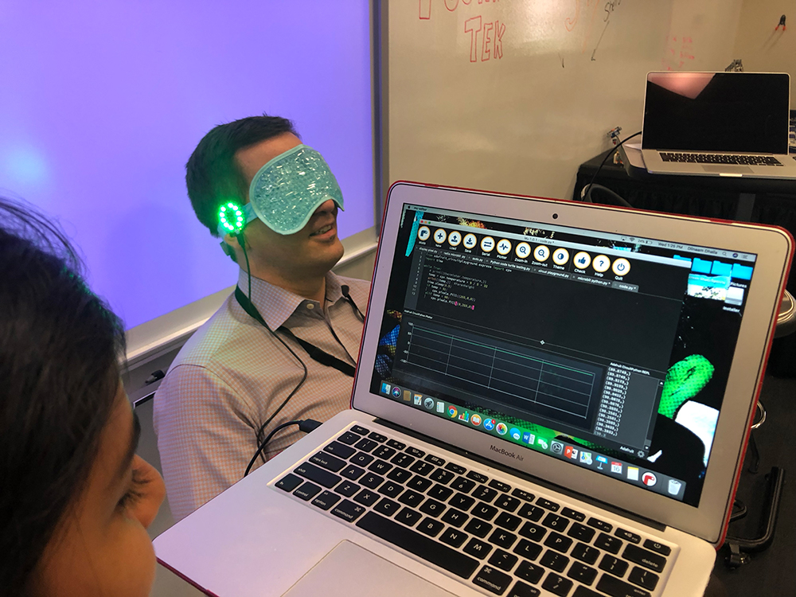

# Stress Management Mask
## by Dilnaam D.
A prototype of a mask to manage stress using Python and a CircuitPlayground Express

This mask was made to demonstrate how a CircuitPlayground Express could be used to measure body temperature and indicate stress levels. My theory is that body temperature is an indicator of stressful feelings and that people can better control their stress when they have a visual indication of their own stress state.

Future versions of my mask could include an automatic cooling feature to help people control their temperature and reduce their stress. 

I designed this mask for my mother, for whom I cause much stress. <3 you, Mom!
